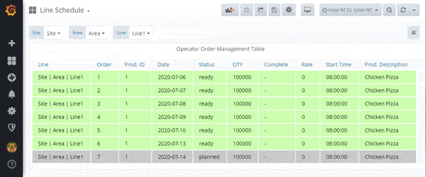
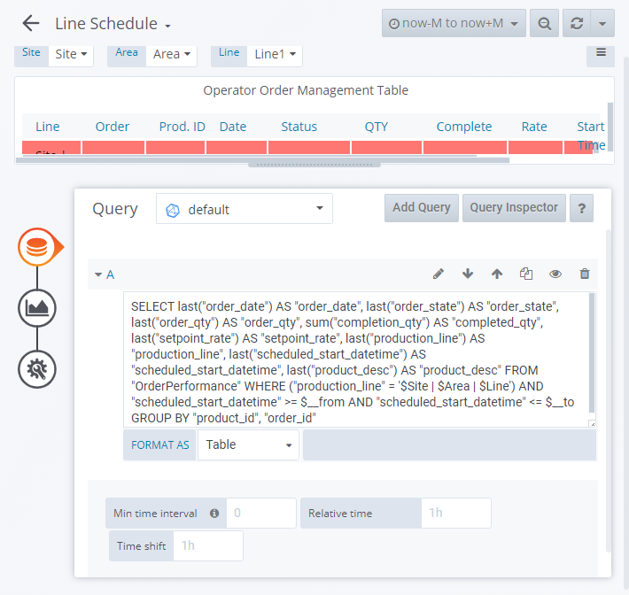

## Libre Operator Order Management Table Panel

| A Libre panel to execute, pause and complete orders for manufacture

This panel gives a operator the ability to execute, pause and complete manufacturing orders for a production line and product. This panel is part of [Libre](https://github.com/Spruik/Libre). This plugin interfaces to a no security json rest api for equipment, orders and products running on the same grafana server. This panel is targeted at Grafana v6.x.x. only.



## Installation

The easiest way to get started with this plugin is to [download the latest release](https://github.com/Spruik/Libre-Operator-Order-Mgt-Table-Panel/releases/latest/download/libre-operator-order-mgt-table-panel.zip), unzip into grafana plugin directory and restart grafana.

Download the latest release

```shell
$ wget https://github.com/Spruik/Libre-Operator-Order-Mgt-Table-Panel/releases/latest/download/libre-operator-order-mgt-table-panel.zip
Resolving github.com (github.com)... 140.82.114.4
...
2020-06-24 20:47:59 (1.08 MB/s) - 'libre-operator-order-mgt-table-panel.zip' saved [90150]
```

Unzip into your Grafana plugin directory

```shell
$ unzip libre-operator-order-mgt-table-panel.zip -d /var/lib/grafana/plugins
Archive: libre-operator-order-mgt-table-panel.zip
...
inflating: /var/lib/grafana/libre-operator-order-mgt-table-panel/utils.js.map
```

Restart Grafana

```shell
$ service grafana-server restart
 * Stopping Grafana Server
 * Starting Grafana Server
```

## Usage

In order to get the most out of this panel:

1. Add a InfluxDB *Table* metric to query orders.

```influxdb
SELECT
  last("order_date") AS "order_date"
  ,last("order_state") AS "order_state"
  ,last("order_qty") AS "order_qty"
  ,sum("completion_qty") AS "completed_qty"
  ,last("setpoint_rate") AS "setpoint_rate"
  ,last("production_line") AS "production_line"
FROM "OrderPerformance"
WHERE
  ("production_line" = '$Site | $Area | $Line')
  AND $timeFilter GROUP BY "product_desc", "product_id", "order_id"
```

2. Apply custom column styles:



### Orders

#### Start

To start an order click the order row in the table. In the actions popup click Start. Orders can only be started from the _Next_ or _Paused_ state.

#### Pause

To pause an order click the order row in the table. In the actions popup click Pause. Orders can only be paused from the _Running_ state.

#### Complete

To complete an order click the order row in the table. In the actions popup click Complete. Orders can only be paused from the _Running_ or _Paused_ state.

## Developing

### Getting Started

A docker-compose and grunt script is provided in order to quickly evaluate source code changes. This requires

Prerequisites

- docker (>= 18 required)
- docker-compose (>= 1.25 required)
- node (>= 12 required)
- npm (>= 6 required)

Start by cloning this repository

```shell
~/
$ git clone https://github.com/Spruik/Libre-Operator-Order-Mgt-Table-Panel
Cloning into 'libre-operator-order-mgt-table-panel'...
remote: Enumerating objects: 46, done.
remote: Counting objects: 100% (46/46), done.
remote: Compressing objects: 100% (31/31), done.
remote: Total 46 (delta 13), reused 46 (delta 13), pack-reused 0
Unpacking objects: 100% (46/46), done.
```

Enter project and install dependencies

```shell
$ cd ./libre-operator-order-mgt-table-panel
~/libre-operator-order-mgt-table-panel
$ npm install
...
added 714 packages from 399 contributors and audited 719 packages in 11.871s
found 42 vulnerabilities (11 low, 6 moderate, 25 high)
  run `npm audit fix` to fix them, or `npm audit` for details
```

Install Grunt globally

```shell
$ npm install grunt -g
C:\Users\user\AppData\Roaming\npm\grunt -> C:\Users\user\AppData\Roaming\npm\node_modules\grunt\bin\grunt
+ grunt@1.1.0
updated 1 package in 1.364s
```

Run grunt to build the panel

```shell
$ grunt

Running "copy:src_to_dist" (copy) task
Created 2 directories, copied 8 files

Running "copy:libs" (copy) task

Running "copy:pluginDef" (copy) task
Copied 1 file

Running "copy:image_to_dist" (copy) task

Running "babel:dist" (babel) task

Done, without errors.

```

Start docker-compose.dev.yml detached

```shell
~/libre-operator-order-mgt-table-panel
$ docker-compose -f docker-compose.dev.yml up -d
Starting libre-operator-order-mgt-table-panel_postgres_1
Starting libre-operator-order-mgt-table-panel_postrest_1
Starting libre-operator-order-mgt-table-panel_simulator_1
Starting libre-operator-order-mgt-table-panel_grafana_1
```

Run grunt watch to recompile on change

```shell
~/libre-operator-order-mgt-table-panel
$ grunt watch
Running "watch" task
Waiting...
```

Open your favourite editor and start editing ./src files. The grunt watch task will detect this and recompile the panel. Use your favourite web browser and point to http://localhost:3000 login and create a dashboard with this panel. Your browser will need to be refreshed to reflect your changes to this panel, ensure your browser isn't caching files.

### Building

Prerequisites

- node (>= 12 required)
- npm (>= 6 required)

Build panel and zip into archive

```shell
~/libre-operator-order-mgt-table-panel
$ grunt build
Running "clean:0" (clean) task
>> 1 path cleaned.

Running "clean:1" (clean) task
>> 1 path cleaned.

Running "copy:src_to_dist" (copy) task
Created 3 directories, copied 9 files

Running "copy:libs" (copy) task


Running "copy:readme" (copy) task
Created 1 directory, copied 8 files

Running "string-replace:dist" (string-replace) task

1 files created

Running "copy:pluginDef" (copy) task
Copied 1 file

Running "babel:dist" (babel) task

Running "compress:main" (compress) task
>> Compressed 44 files.

Done, without errors.
```

Find a completed build of this panel in the root directory named `libre-operator-order-mgt-table-panel.zip`.

## Contributing

For any issue, there are fundamentally three ways an individual can contribute:

- By opening the issue for discussion: For instance, if you believe that you have uncovered a bug in, creating a new issue in the [GitHub issue tracker](https://github.com/Spruik/Libre-Operator-Order-Mgt-Table-Panel/issues) is the way to report it.
- By helping to triage the issue: This can be done either by providing supporting details (a test case that demonstrates a bug), or providing suggestions on how to address the issue.
- By helping to resolve the issue: Typically, this is done either in the form of demonstrating that the issue reported is not a problem after all, or more often, by opening a Pull Request that changes some bit of something in the panel in a concrete and reviewable manner.

## Change log

- 1.0.0 Initial Public Release
